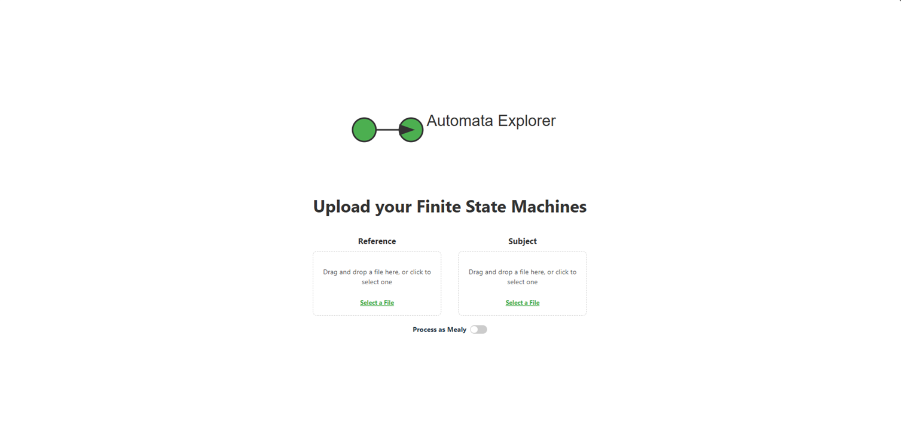
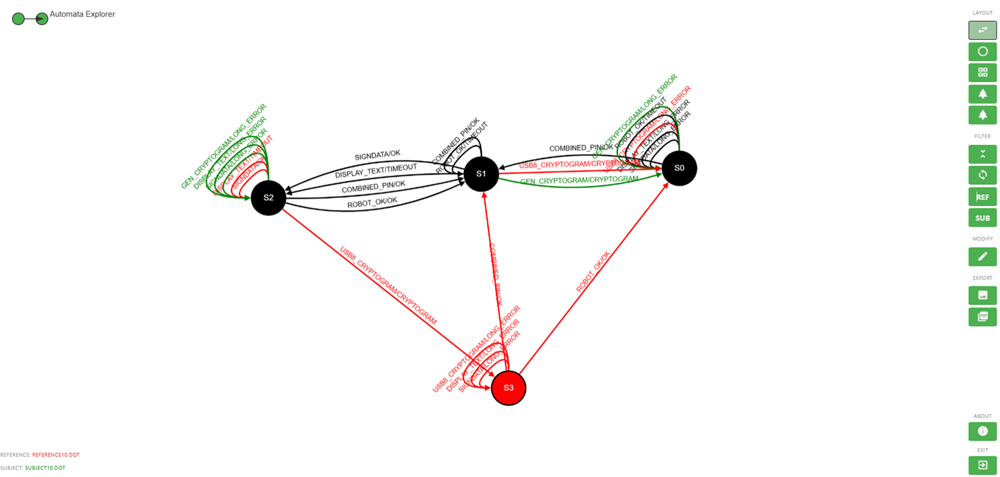

# AutomataExplorer: visualize and compare automata

The Automata Explores is a web-based tool to visualize differences and similarities between (finite) state machines. The tool is interactive and helps users to analyze, interpreted and understand the comparison results. The tool offers multiple filters and manipulations to investigate the results from different viewpoints and perspectives. To compare and merge the inputs into the difference automate the [gLTSdiff library](https://github.com/TNO/gLTSdiff) is used. The difference automata is a single combined automata where common parts, reference-only and subject-only are color coded, an example can be found below under preview. 

This Automata Explores is developed in the context of automata learning and supports two kinds of automata's. A regular automata where the matching for the difference machine is based on the complete label. And the Mealy machine where the matching is based on input and output under the condition that labels are structured as *input/output*. The (backend) build and processing actions are standardized (type based) and therefore easy to extend to support new types or (gLTSDiff) build configurations.

## Core features
- **Input** two automata's in the [`.dot format`](https://graphviz.org/doc/info/lang.html) and visualize the difference machine. 
- Select a **layout algorithm** that is most suitable for the visualization. 
- Use **filters** and/or custom **processing actions** to investigate the result. 
- Use the **context menu** options on visualization elements to work through the result or get detailed element information. 
- **Export** the result as a `.pgn` or comprehensive `.pdf` report. 

## Preview

  
  

## Documentation

* [Getting Started](/docs/getting-started.md) -  installation and setup.
* [Example - Vending Machine](/docs/example-vm.md) -  basic illustrative example
* [Functionality](/docs/functionality.md) -  all functionality explained.
* [Project structure & Architecture](/docs/structure-and-architecture.md)
* [gLTSdiff](https://github.com/TNO/gLTSdiff) - the library used for comparison and matching inputs. 

## License
This project is licensed under the MIT License - see the [LICENSE](LICENSE) file for details.