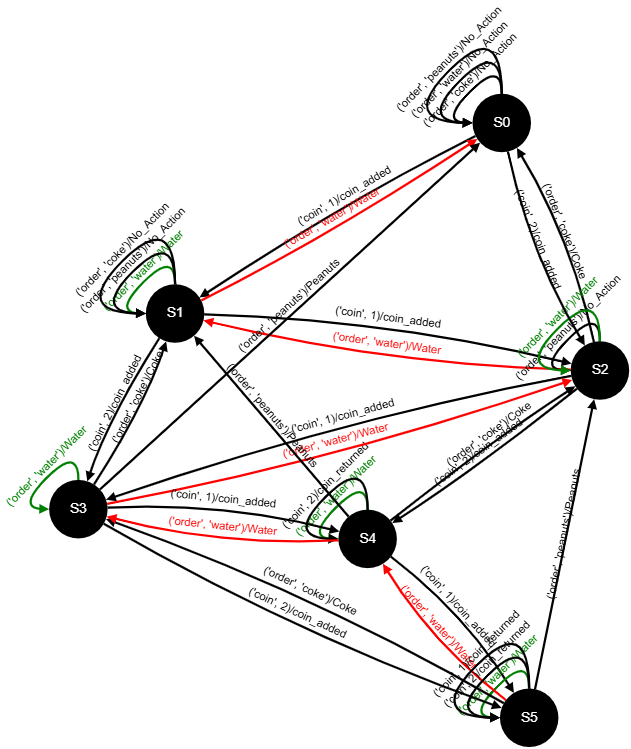

# Example - Vending machine
This example demonstrates how the **AutomataExplorer** tool visualizes and highlights differences between two vending machines. The vending machine accepts coins and dispenses drinks (water or coke) or peanuts based on the inserted amount. The states represent the number of coins inserted and the transitions represent the user actions. 

## Learn 
Two vending machine models were learned using [AAlPy](https://github.com/DES-Lab/AALpy) with this [example](https://gist.github.com/emuskardin/28e543f942f8b720b75ef7c57aac9199): 

- `vm_reference.dot` : the regular vending machine 
- `vm_subject.dot` : a mutated vending machine with a bug

Below a small snippet of the reference DOT file. Although it's readable, comparing it line by line with the subject file makes is hard to spot differences, even for this simple example. 

```dot
digraph vm_reference {
s0 [label="s0"];
s1 [label="s1"];
...
s0 -> s1 [label="('coin', 1)/coin_added"];
s0 -> s2 [label="('coin', 2)/coin_added"];
s0 -> s0 [label="('order', 'coke')/No_Action"];
s0 -> s0 [label="('order', 'water')/No_Action"];
...
}
```

## Visualize
To highlight the differences between the two models, both DOT files are loaded into the **Automata Explorer**.  The resulting visualization is a single, merged (difference) automaton where nodes and edges are color-coded:

- `black`   : common, available in both models
- `red`     : removed, only in the regular vending machine (reference) 
- `green`   : added, only in the mutated vending machine (subject).



## Analysis
Now that the models are compared and visualized in a single view, the analysis can start. It is easy to spot that the transitions for ordering water are different between the vending machines. In the subject machine ordering water does not lead to a state change. In other words the vending machine is dispensing water without subtracting a coin revealing the (introduced) bug. 

```python
# reference - correct
if order == 'water':
    if self.coin_count >= 1:
        self.coin_count -= 1
        return 'Water'

# subject - bug
if order == 'water':
    if self.coin_count >= 1:
        return 'Water'  # BUG: coin not subtracted
```
