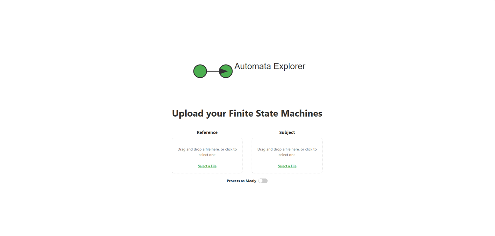
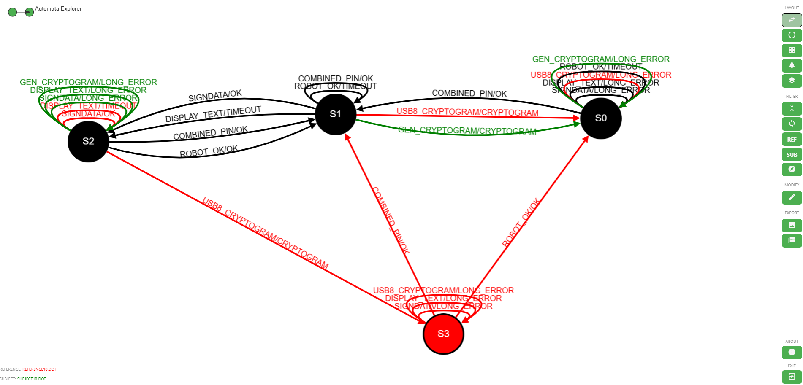

# Functionality
This page describes the functionality provide by the **AutomataExplorer** by page. 

## Upload Page

### Drag and Drop
The drag and drop area allows users to load the input files by either selecting them via file dialog or bt simply dragging them into place. 

### Process as Mealy
The process as Mealy toggle determines whether the inputs should be interpreted as a Mealy machine or a regular (label based) automata. 

## Visualization Page

### Sidebar
The sidebar provides controls for customizing and exploring the difference automaton. 

#### Layout
Select a layout algorithm that provides the best visualization for the supplied inputs. The available options are: 
- [dagre](https://github.com/cytoscape/cytoscape.js-dagre) - layout for DAGs and trees (default)
- [avsdf](https://github.com/iVis-at-Bilkent/cytoscape.js-avsdf) - Circular layout with minimal crossings
- [elk - layered](https://github.com/cytoscape/cytoscape.js-elk) - layout for DAGs and trees
- [grid](https://js.cytoscape.org/#layouts/grid) - puts all nodes in a well spaced grid
- [breadthfirst](https://js.cytoscape.org/#layouts/breadthfirst) - put nodes in hierarchy based on traversal.

The layout can also be adjusted interactively by dragging nodes to rearrange the automata for clearer visualization. 

#### Filter
Filters adjust the visualization without modifying the actual model or inputs.
- Expand and collapse edges with the same type between source and target nodes. 
- Show / hide edges where the source node is the target (loop).  
- Show hide the elements which have the reference type.
- Show hide the elements which have the subject type.

#### Modify
Adjust the visualization using processing actions which modify the inputs or output. The available options depend on the automata type as selected at the upload page. The available options are loaded automatically in the Modify Modal. All actions have:

- `Stage`: processing action on the inputs (PRE), or on the difference machine (POST)
- `Type`: the processing action type such as: hider or synonym.  
- `Subtype`: the processing actions subtype such as: loop, label, input or output
- `Name`: description or name value for the action
- `Value`: the value(s) for the action. 

#### Export
- Export the visualization as a `.pgn` image file.
- Export the comparison result as a `.pdf` report with the match results, an image and a structured tabular with the edges. 

#### About
Display the about information.

#### Exit
Exit the visualization and return to the upload page. 

### Context Menu 
On right click on nodes or edges a [context menu](https://github.com/cytoscape/cytoscape.js-cxtmenu) is presented.

- Check, uncheck - mark element as checked or unchecked by modifying appearance. 
- Show / hide star - mark the node with a star (node only)
- Open info modal - display element information in a Modal.
- Show / hide pie chart - display node as pie chart based on connected edges (node only)
- Show neighbors - highlight connected transitions and edges.
- Show / hide label - put label on node with a custom text (node only).